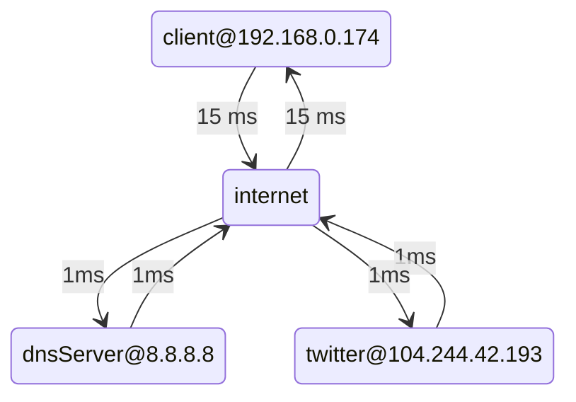

# 2023-06-04-laboratory

This repository contains a simple command that simulates several censorship conditions
using [ooni/netem](https://github.com/ooni/netem) and measures them using
[ooni/probe-engine](https://github.com/ooni/probe-engine). We intend to use
this code in a laboratory to explain to young students how internet censorship works.

## Build and run

You need to build this code using Go 1.20.4. Assuming you are on Linux (or another
Unix-like system), and you have already installed a recent version of Go, you can
install Go 1.20.4 by running these two commands:

```console
go install golang.org/dl/go1.20.4@latest
~/go/bin/go1.20.4 download
```

Then, to run the program used in this laboratory, use:

```console
~/go/bin/go1.20.4 run .
```

## Uncensored Simulation

We simulate the following scenario:



There is a client with a private IP address. The client is connected
to the internet. On the internet, we also have: (1) a DNS server using
the `8.8.8.8` IP address; (2) a web server for twitter using the
`104.244.42.193` IP address.

When you run:

```console
~/go/bin/go1.20.4 run .
```

the client (1) uses the DNS server to obtain the IP address for
`twitter.com` and then (2) creates a TCP connection to the returned
IP address, performs a TLS handshake, and fetches a webpage.

The code in [probe.go](probe.go) is normal code that we
would use in [ooniprobe](https://github.com/ooni/probe-cli). The rest
of the codebase uses [ooni/netem](https://github.com/ooni/netem) to
simulate all the required servers and to steal the traffic produced by
[probe.go](probe.go) to use the simulation instead of the real internet.

## DNS Censorship

If you run this command:

```console
~/go/bin/go1.20.4 run . -dpi dns
```

you additionally use [ooni/netem](https://github.com/ooni/netem) to
simulate DNS censorship. We simulate a "middle box" that reads DNS
requests and sends spoofed DNS responses to the client when the domain
is `twitter.com`. The spoofed responses contain invalid addresses to
which the [probe.go](probe.go) will fail to connect.

## TCP Censorship

If you run this command:

```console
~/go/bin/go1.20.4 run . -dpi tcp
```

you additionally use [ooni/netem](https://github.com/ooni/netem) to
simulate TCP censorship. We simulate a "middle box" that drops outgoing
`SYN` segments for the `104.244.42.193` IP address, thus causing
[probe.go](probe.go) to timeout when connecting.

## TLS Censorship

If you run this command:

```console
~/go/bin/go1.20.4 run . -dpi tls
```

you additionally use [ooni/netem](https://github.com/ooni/netem) to
simulate TLS censorship. We simulate a "middle box" that filters
outoing `ClientHello` TLS records and, if the SNI is `twitter.com`,
it forges a `RST` segment that causes the connection to reset.

## Packet Captures

Each invocation of the program captures packets traveling through
[ooni/netem](https://github.com/ooni/netem) and writes them inside
the `client.pcap` file. The repository already includes a PCAP
file for each possible configuration of the simulation.
